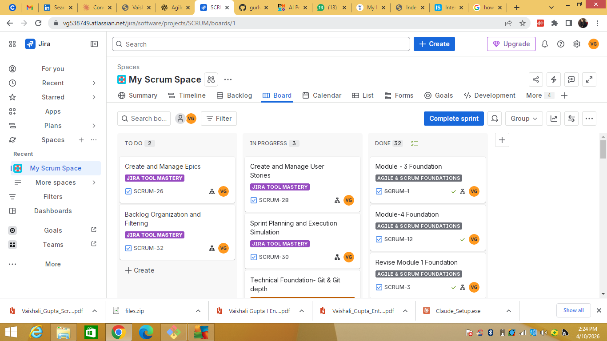

# 🏃 Scrum Master – Self-Initiated Agile Project

> A fully structured, hands-on Agile simulation project built to practice and demonstrate real-world Scrum Master skills — including sprint facilitation, Jira board management, backlog grooming, and technical foundation work.

---

## 📋 Project Overview

| Detail | Info |
|--------|------|
| **Role** | Scrum Master (Self-Initiated) |
| **Tool** | Jira (My Scrum Space) |
| **Format** | Active Sprint Board |
| **Status** | 🟢 In Progress |
| **Tasks Completed** | 32+ |
| **Epics** | 3 |

---

## 🗂️ Epics Breakdown

### 1. 🔧 Jira Tool Mastery
Focused on learning and applying Jira as a professional Scrum tool.

**Key tasks include:**
- Create and Manage Epics
- Backlog Organization and Filtering
- Create and Manage User Stories
- Sprint Planning and Execution Simulation

### 2. 📚 Agile & Scrum Foundations
Deep dive into the theory and practical application of Scrum ceremonies and Agile principles.

**Key tasks include:**
- Module 1–4 Foundation (Completed ✅)
- Revise Module 1 Foundation
- Sprint Reviews and Retrospectives
- Daily Stand-up Simulation

### 3. 💻 Technical Foundation of Scrum
Built technical knowledge to enable meaningful conversations with development teams as a Scrum Master.

**Key tasks include:**
- Technical Foundation – Git & Git Depth
- Check commit history using git log
- Simulate and resolve merge conflicts
- System architecture mapping (Frontend → API → Backend → Database)

---

## 🖥️ Live Jira Board

> **Board:** My Scrum Space  
> **Project Key:** SCRUM  
> **Columns:** To Do → In Progress → Done

---

## 🛠️ Tools & Skills Used

| Tool / Skill | Usage |
|---|---|
| **Jira** | Sprint board, backlog, epics, burn-down tracking |
| **Git & GitHub** | Branching, commits, PR reviews, merge conflict resolution |
| **Agile / Scrum** | Sprint Planning, Stand-ups, Reviews, Retrospectives |
| **System Architecture** | Frontend → API → Backend → Database flow mapping |

---

## 📁 Related Repository

| Repo | Description |
|------|-------------|
| [git-practise](https://github.com/gurlvish/git-practise) | Git branching, commit workflows, and PR practices for Scrum Master collaboration |

---

## 👩‍💼 About the Author

**Vaishali Gupta** — Entry-Level Scrum Master | Agile Practitioner | Remote-Ready

- 🔗 [LinkedIn](https://www.linkedin.com/in/vaishali-gupta-97843a166)
- 💻 [GitHub](https://github.com/gurlvish)
- 📧 vaishali.gupta.pm@gmail.com

> *This project is part of an active job-seeking portfolio demonstrating practical Scrum Master capabilities.*
